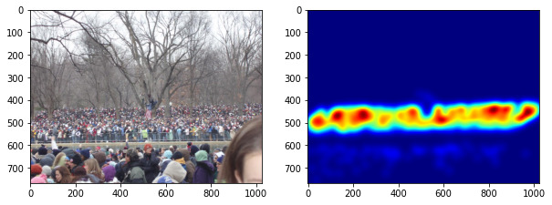
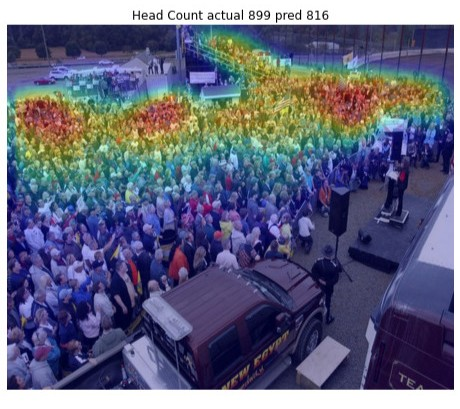
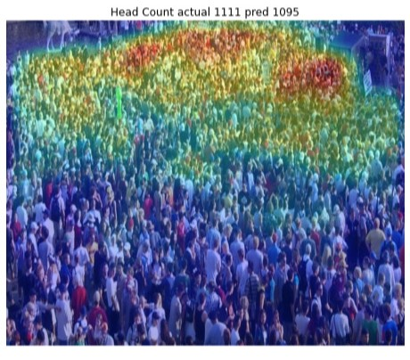
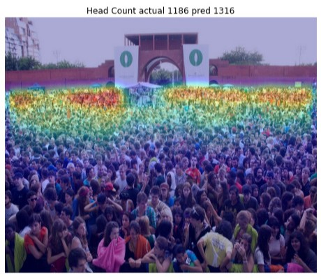
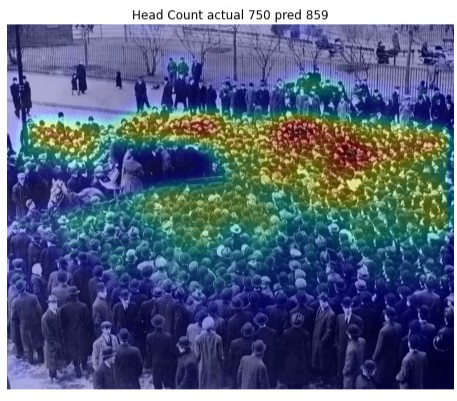
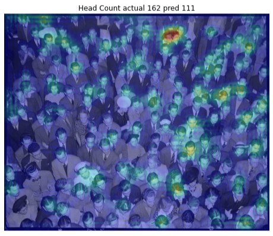
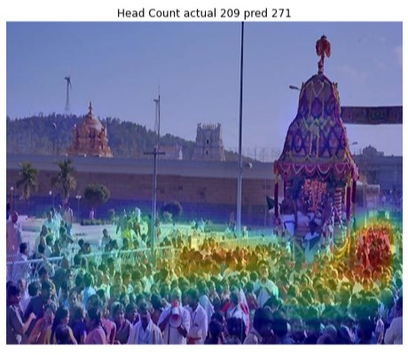
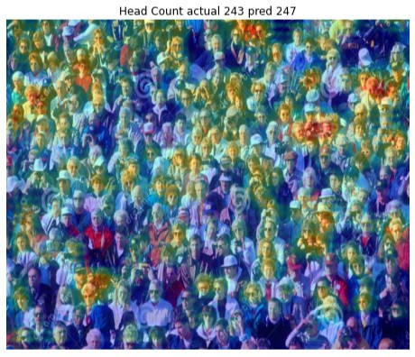

# Stempede Detection [](https://colab.research.google.com/github/breathingcyborg/stempede-detection/blob/main/stempede.ipynb)

Many people haved died of crushing, during religious pligrimages or other events. When huge crowd gathers over small region, the risk of stempede increases.

Number of deaths caused by crushing of humans in stempede from 2010 to 2021.

| Nation        | Death Toll (2010-2021) |
| ------------- | ----------- |
| Saudi Arabia  | 2400        |
| India         | 504         |
| Cambodia      | 347         |
| Ethiopia      | 300         |
| Brazil        | 251         |
| Egypt         | 105         |

These deaths could be easily prevented by proper crowd management practices. A machine learning model can be trained to estimate crowd density, and give early warning before stempede occurs.

# Crowd Density map

Instead of directly predicting crowd count, model predicts a density map. The density map highlights region with people in it. To obtain crowd count one can sum the density map. The notebook contains various methods of generation of density map.



# Results [](https://colab.research.google.com/github/breathingcyborg/stempede-detection/blob/main/stempede.ipynb)

A [CSRNet](https://arxiv.org/abs/1802.10062) model is trained on [ShanghaiTech A](https://www.kaggle.com/tthien/shanghaitech) dataset.Pytorch library is used. The notebook contains all code needed right from downloading dataset, processing data, to training and inference.

The model was trained on google colab and uses google drive for storing and restoring model checkpoints. The best model weights are provided in this repo.

Below are some predictions of model on test dataset.

## High Density Crowd





## Medium Density Crowd




# Evaluation

Model was trained on ShanghaiTech Part A Dataset. The dataset contains images of dense crowd from various perspectives and at various scales. The small size of dataset makes it challenging.

For evaluation RMSE(Root Mean Square Error) and MAE (Mean Absolute Error) between predicted head count and actual head count were used.

Model was trained for 30 epochs and then for 5 more epochs.

```
RMSE   113.58
MAE    74.38
```